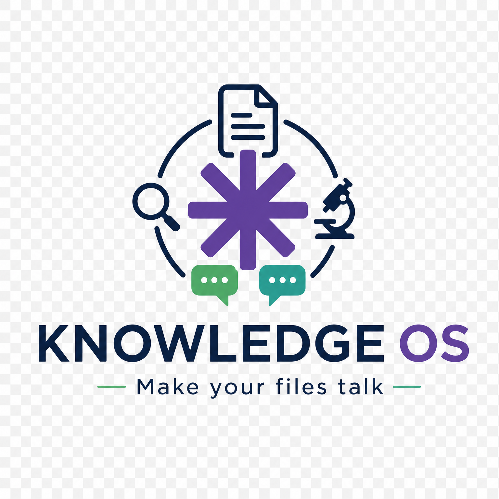
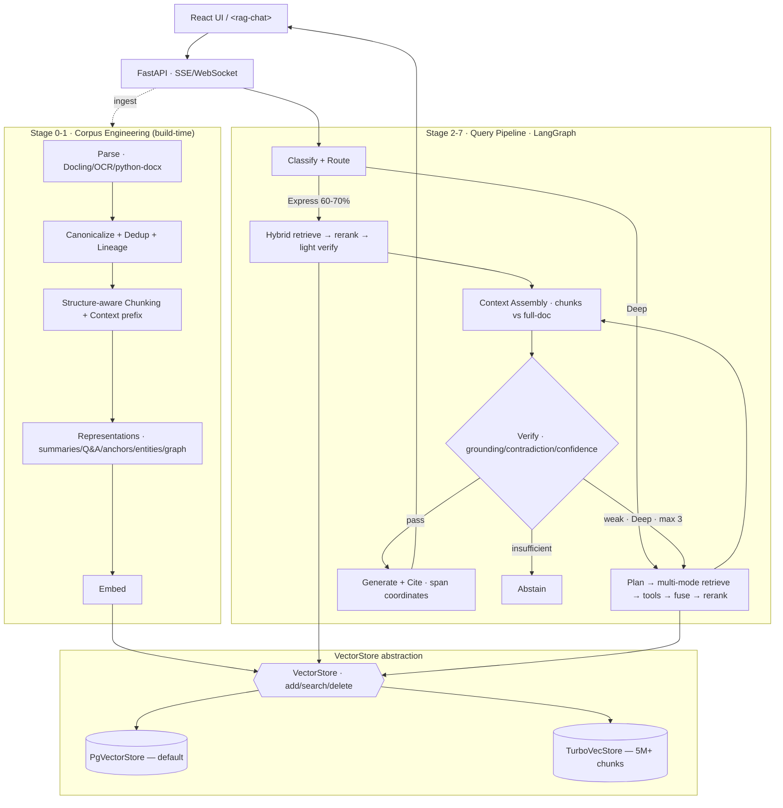

<div align="center">



# Knowledge OS

### The retrieval-first knowledge engine that refuses to hallucinate.

**Verify → then generate.** Every answer is grounded in your documents, cited to the exact span, and abstained on when the evidence isn't there. Built for enterprise corpora, multi-tenant from day one, and provider-agnostic across Anthropic, OpenAI, Gemini, and local models.

<p>
<a href="#-quickstart"></a>
<a href="./docs/ARCHITECTURE.md"></a>
</p>

<p>
<a href="https://github.com/anantbhandarkar/knowledge-os/actions/workflows/ci.yml"></a>


</p>

⭐️ **Star this repo** to follow along — we ship the verify-gate, agentic Deep Lane, and visual retrieval in public.

[**Quickstart**](#-quickstart) · [**Features**](#-key-features) · [**Architecture**](#-architecture) · [**Roadmap**](#-roadmap) · [**Contributing**](#-contributing) · [**License**](#-license)

</div>

---

## 📚 Table of Contents

- [Why Knowledge OS?](#-why-knowledge-os)
- [Key Features](#-key-features)
- [Architecture](#-architecture)
- [The Pipeline](#-the-pipeline)
- [Quickstart](#-quickstart)
- [Configuration](#-configuration)
- [API](#-api)
- [Performance](#-performance)
- [Project Status](#-project-status)
- [Roadmap](#-roadmap)
- [How It Compares](#-how-it-compares)
- [Contributing](#-contributing)
- [Star History](#-star-history)
- [License](#-license)
- [Acknowledgements](#-acknowledgements)

---

## 🧭 Why Knowledge OS?

Most "enterprise RAG" is a vector-search chatbot: embed chunks, run `top_k`, stuff the prompt, and hope the LLM doesn't make things up. It does. In regulated, high-stakes settings — legal, finance, security, healthcare — *plausible-but-wrong* is worse than *no answer*.

**Knowledge OS inverts the contract.** Truth lives in your documents, databases, and graphs — never in the model's weights. The LLM is a *processing engine over retrieved evidence*, not a source of facts. Concretely:

| Principle | What it means for you |
|---|---|
| 🔒 **Verify → then generate** | No token is produced until retrieved evidence passes a grounding gate. Fail → repair loop, not hallucination. |
| 📌 **Cite every claim** | Each sentence maps to a `doc_id`, page, section, and **character span** — render clickable highlights like NotebookLM. |
| 🙅 **Abstain when unsure** | "I don't have sufficient evidence" is a correct, first-class answer. |
| 🧬 **Multi-representation** | One corpus → canonical chunks + hierarchical summaries + synthetic Q&A + retrieval anchors + entity index + knowledge graph. |
| 🔀 **Hybrid retrieval** | Vector + BM25 + graph + SQL + summary + Q&A, fused (RRF/DBSF) and **always reranked** with a cross-encoder. |
| ⚡ **Two-lane orchestration** | An **Express Lane** answers 60–70% of queries deterministically in <1s; a constrained-agentic **Deep Lane** handles multi-hop work. |
| 🏢 **Multi-tenant by design** | ACL filtering happens *before* retrieval, at the database, in the `WHERE` clause. No cross-tenant leakage. |

> **Knowledge OS is NOT** a `top_k` chatbot, a prompt-engineering wrapper, or a system that trusts the LLM to "know" your enterprise.

---

## ✨ Key Features

- **🚦 Express / Deep lane routing** — intent classification routes simple lookups to a fast deterministic path and complex queries to a LangGraph state machine with repair loops. No query pays for orchestration it doesn't need.
- **🛡️ Closed-book verification gate** — structured `{claim, evidence_span, confidence}` outputs checked by a cheap model; unsupported claims are stripped before they reach the user.
- **🔁 Bounded repair loop** — on weak evidence the Deep Lane reformulates, expands modes, escalates tools, and retries (max 3) — then abstains gracefully.
- **🧩 Pluggable everything** — `Embedder`, `Reranker`, `Generator`, and `VectorStore` are `Protocol`s. Swap Gemini ↔ OpenAI ↔ local with a config line.
- **🗄️ Swappable vector store** — `PgVectorStore` (default, one SQL query for vector + BM25 + ACL) scales to ~2M chunks; `TurboVecStore` (quantized, 8× less RAM) flips on via `VECTOR_STORE=turbovec` for 5M+ chunks — **zero pipeline changes**.
- **🧠 Contextual embeddings** — every chunk is prefixed with document/section context before embedding (Anthropic's technique), cutting retrieval-failure rates dramatically.
- **📄 Full-document stuffing** — when retrieval concentrates on ≤5 docs that fit the window, stuff whole parsed docs instead of fragments (the NotebookLM pattern).
- **📊 Eval-gated** — RAGAS faithfulness/relevancy/precision + a golden dataset + regression CI. "Low hallucination" is *measured*, not asserted.
- **🔭 Observable** — OpenTelemetry traces per stage, Langfuse/Phoenix integration, and an explicit failure taxonomy (ACL contamination, citation drift, repair exhaustion…).
- **🔌 Headless + embeddable** — SSE/WebSocket streaming backend and a framework-agnostic `<rag-chat>` Web Component that drops into any host app.

---

## 🏛️ Architecture

Four layers: **offline corpus engineering** builds the stores; the **online query pipeline** forks into Express/Deep lanes; the **VectorStore abstraction** hides the storage engine; **cross-cutting** concerns (security, memory, observability, eval) wrap both.



📐 **Full diagrams** (system, query lifecycle, VectorStore two-step retrieval, latency budget) live in **[docs/ARCHITECTURE.md](./docs/ARCHITECTURE.md)**.

---

## 🔬 The Pipeline

```
0. Corpus Engineering   → parse · normalize · dedup · chunk · enrich
1. Representations       → summaries · Q&A · anchors · entities · graph
2. Understand + Classify → intent → Express Lane | Deep Lane
3. Retrieve              → hybrid (vector + BM25 + graph + SQL + Q&A + summary)
4. Fuse + Rerank         → RRF/DBSF fusion → cross-encoder rerank (mandatory)
5. Context Assembly      → chunk assembly OR full-document stuffing
6. Verify                → grounding · contradiction · confidence (gate)
7. Repair (Deep only)    → reformulate · expand · retry (max 3)
8. Generate + Cite       → evidence-only · span-level citations
9. Evaluate + Observe    → RAGAS · traces · failure taxonomy · regression
```

Each stage is an independent, testable module under [`app/`](./app). The online pipeline is a compiled **LangGraph** state machine ([`app/graph.py`](./app/graph.py)) — auditable, with explicit state transitions, exactly what regulated deployments require.

---

## 🚀 Quickstart

> **Runs offline out of the box.** The default mode uses deterministic embeddings and an *extractive* generator (grounded by construction — it cannot hallucinate), so the Express Lane works with **no API keys and no Postgres**. Set `KOS_MODE=api` for real LLMs and `VECTOR_STORE=pgvector` for production storage.

### Option A — Docker Compose

```bash
git clone https://github.com/anantbhandarkar/knowledge-os.git
cd knowledge-os
docker compose up -d --build     # offline mode, zero config
# API live at http://localhost:8000  (Swagger at /docs)
# The bundled demo corpus auto-ingests on startup.
```

### Option B — Local (Python 3.12+)

```bash
git clone https://github.com/anantbhandarkar/knowledge-os.git
cd knowledge-os
python -m venv .venv && source .venv/bin/activate
pip install -e ".[dev]"
uvicorn app.api:app --reload     # demo corpus auto-ingests on startup
```

### Ask a question

```bash
curl -s http://localhost:8000/health
# {"status":"ok","mode":"offline","chunks":15}

curl -s -X POST http://localhost:8000/chat \
  -H "Content-Type: application/json" \
  -d '{"query": "What is the JWT expiry for contractor accounts?"}'
```

Real, verified output from the bundled demo corpus:

```jsonc
{
  "answer": "Contractor accounts are issued JWT tokens with a 4-hour TTL, reflecting their reduced trust level. [platform-security-policy]",
  "lane": "express",
  "verification_result": "pass",
  "citations": [{ "source_doc_title": "platform-security-policy", "section_path": ["Authentication", "Token Management"], "...": "..." }]
}
```

Ask something the corpus doesn't cover and it **abstains instead of guessing**:

```jsonc
// "What is the password policy on the Moon?"
{ "answer": "I don't have sufficient evidence to answer this confidently...", "verification_result": "abstain" }
```

### Ingest your own documents

```bash
curl -s -X POST http://localhost:8000/ingest \
  -H "Content-Type: application/json" \
  -d '{"text": "# My Policy\n\nTokens expire after 1 hour.", "doc_title": "My Policy"}'
```

```jsonc
// /chat returns the answer plus citation coordinates for clickable highlights
{
  "answer": "Contractor JWT tokens expire after 4 hours.",
  "citations": [{
    "claim_text": "Contractor JWT tokens expire after 4 hours",
    "source_doc_title": "Platform Security Policy v3.2",
    "page": 12, "section_path": ["Authentication", "Token Management"],
    "evidence_span": "Contractor accounts are issued JWT tokens with a 4-hour TTL...",
    "span_start_char": 1247, "span_end_char": 1312, "confidence": 0.94
  }],
  "verification_result": "pass",
  "retrieval_confidence": 0.91
}
```

### Run it in code

```python
from app.graph import COMPILED_GRAPH
from app.models import PipelineState

state = await COMPILED_GRAPH.ainvoke(
    PipelineState(query="Who owns the auth-service?", tenant_id="acme")
)
print(state["answer"], state["citations"])
```

---

## ⚙️ Configuration

Providers and stores are wired via config, never code. Swapping is one line:

```yaml
# config/providers.yaml
embeddings:
  default: gemini-embed          # or: openai-3-large | local-bge
rerank:
  default: cohere-rerank-4        # or: qwen3-reranker-4b | minilm (CPU)
generation:
  default: claude                 # or: gemini | openrouter | local
store:
  vector: pgvector                # or: turbovec  (set VECTOR_STORE=turbovec)
  lexical: postgres_fts
```

Secrets come from environment variables (`ANTHROPIC_API_KEY`, `COHERE_API_KEY`, …) — never hardcoded.

---

## 🔌 API

| Endpoint | Method | Purpose |
|---|---|---|
| `/ingest` | POST | Upload and process documents |
| `/chat` | POST | Conversational RAG query (streaming, with citations) |
| `/search` | POST | Direct retrieval, no generation |
| `/reindex` | POST | Trigger reindexing (full or partial) |
| `/feedback` | POST | Submit user feedback on an answer |
| `/health` | GET | Health & readiness |
| `/metrics` | GET | Pipeline metrics & per-stage latency |

---

## ⚡ Performance

Targets validated against a production-scale corpus:

| Target | Express Lane | Deep Lane |
|---|---|---|
| End-to-end P95 | **< 2s** | < 5s |
| First token | **< 1s** | < 3s |
| Retrieval P95 | < 500ms | < 1.5s |
| Reranking P95 | < 300ms | < 500ms |
| Intent classification | < 100ms | < 100ms |

Express Lane carries 60–70% of traffic → blended P95 stays under 3s. Optimization levers: async parallel retrieval, reranker batching, semantic caching, adaptive retrieval depth, and complexity-based model selection.

---

## 📍 Project Status

Knowledge OS is being built **in public, phase by phase**. Current state of the scaffold:

**✅ Express Lane runs end-to-end offline today** — ingest → hybrid retrieve → rerank → verify → cited answer (or abstention). Verified by `tests/test_smoke.py`.

| Module | Status |
|---|---|
| `app/graph.py` — LangGraph spine + lane fork + repair loop | ✅ complete |
| `app/models.py` — typed domain contracts | ✅ complete |
| `app/vectorstore/` — `VectorStore` + `InMemoryVectorStore` | ✅ complete (offline) |
| `app/ingest.py` — heading-aware chunking + contextual prefix | ✅ complete |
| `app/retrieval.py` — ACL-filtered hybrid (vector + BM25) | ✅ complete |
| `app/rerank.py` — RRF fusion + reranker | ✅ complete |
| `app/verify.py` / `app/routing.py` — gate + lane decisions | ✅ starter defaults (tunable) |
| `app/generation.py` — extractive default + grounding judge | ✅ complete (offline) |
| `app/api.py` — FastAPI `/chat` `/ingest` `/search` `/health` | ✅ complete |
| Real LLM providers (`KOS_MODE=api`) | ⏳ drivers next |
| `PgVectorStore` / `TurboVecStore` | ⏳ Phase 3 |
| Deep Lane LLM planner, multi-rep, RAGAS | ⏳ Phase 2 |

---

## 🗺️ Roadmap

- [x] **Phase 1 — Foundation** *(Weeks 1–4)* · PDF/Markdown parsing, structure-aware chunking, contextual embeddings, `PgVectorStore`, hybrid retrieval (Express Lane), cross-encoder reranking, lightweight verification, citation-grounded streaming generation, FastAPI, Docker, 50-question golden set.
- [ ] **Phase 2 — Intelligence** *(Weeks 5–10)* · Hierarchical summaries, synthetic Q&A + anchors, entity index, knowledge graph, **Deep Lane** LLM planning via LangGraph, full repair loop, full verification engine, semantic cache, memory layer, RAGAS integration.
- [ ] **Phase 3 — Enterprise** *(Weeks 11–16)* · Multi-tenant isolation, RBAC, guardrails (prompt-injection/PII/poisoning), **ColQwen2.5 visual retrieval**, SQL/API tools, React UI with clickable citations, `TurboVecStore`, embedding lifecycle, distributed tracing, failure dashboards.
- [ ] **Phase 4 — Scale + Optimize** *(Weeks 17+)* · Kubernetes + autoscaling, cost-aware routing, full RAPTOR clustering, GraphRAG community detection, durable memory, drift detection, DSPy prompt optimization, A/B framework, DR + runbooks.

---

## 🆚 How It Compares

| | Knowledge OS | `top_k` RAG bot | Generic agent framework |
|---|---|---|---|
| Verify-before-generate gate | ✅ hard gate | ❌ | ⚠️ optional |
| Span-level citations | ✅ char offsets | ⚠️ doc-level | ⚠️ varies |
| Abstains on weak evidence | ✅ first-class | ❌ guesses | ⚠️ varies |
| Deterministic fast path | ✅ Express Lane | ✅ (only path) | ❌ always agentic |
| Multi-tenant ACL pre-filter | ✅ in DB | ❌ filter-after | ❌ |
| Pluggable vector store at scale | ✅ pg ↔ TurboVec | ❌ | ⚠️ |

> Knowledge OS composes proven building blocks (**LlamaIndex** for retrieval, **LangGraph** for orchestration, **RAGAS** for eval) rather than reinventing them — and adds the verify-gate and lane routing on top.

---

## 🤝 Contributing

Contributions are welcome and appreciated! Knowledge OS is intentionally modular so each pipeline stage can be improved independently.

1. **Fork** and create a feature branch (`git checkout -b feat/your-feature`).
2. Keep changes **typed** (strict mypy) and **async-first**; add unit tests for new modules.
3. Run the suite: `pytest && ruff check . && mypy app`.
4. Open a PR describing **what** changed and **which pipeline stage** it touches.

Good first issues: implement `classify_lane` routing heuristics, add a parser for a new format, wire an additional reranker backend, or expand the golden dataset. See [`docs/ARCHITECTURE.md`](./docs/ARCHITECTURE.md) to orient yourself before diving in.

---

## ⭐ Star History

If Knowledge OS is useful to you, a star helps others find it.

[](https://star-history.com/#anantbhandarkar/knowledge-os&Date)

---

## 📄 License

Knowledge OS is licensed under the **[Apache License 2.0](./LICENSE)**.

You are free to use, modify, and distribute it — including commercially — provided you preserve the license and notices. The Apache 2.0 license also includes an **express grant of patent rights** from contributors to users, which makes it a safe choice for enterprise adoption.

```
Copyright 2026 The Knowledge OS Authors

Licensed under the Apache License, Version 2.0 (the "License");
you may not use this file except in compliance with the License.
You may obtain a copy of the License at

    http://www.apache.org/licenses/LICENSE-2.0

Unless required by applicable law or agreed to in writing, software
distributed under the License is distributed on an "AS IS" BASIS,
WITHOUT WARRANTIES OR CONDITIONS OF ANY KIND, either express or implied.
See the License for the specific language governing permissions and
limitations under the License.
```

---

## 🙏 Acknowledgements

Knowledge OS stands on the shoulders of the open-source RAG ecosystem — **LlamaIndex**, **LangGraph/LangChain**, **RAGAS**, **pgvector**, **Docling**, and the contextual-retrieval and RAPTOR research lines. Inspired by the production patterns of **RAGFlow**, **Haystack**, and **NotebookLM**.

<div align="center">

**Built for teams that need answers they can trust — and trace.**

⭐️ Star us · 🐛 [Report a bug](https://github.com/anantbhandarkar/knowledge-os/issues) · 💡 [Request a feature](https://github.com/anantbhandarkar/knowledge-os/issues) · 📖 [Architecture](./docs/ARCHITECTURE.md)

</div>
