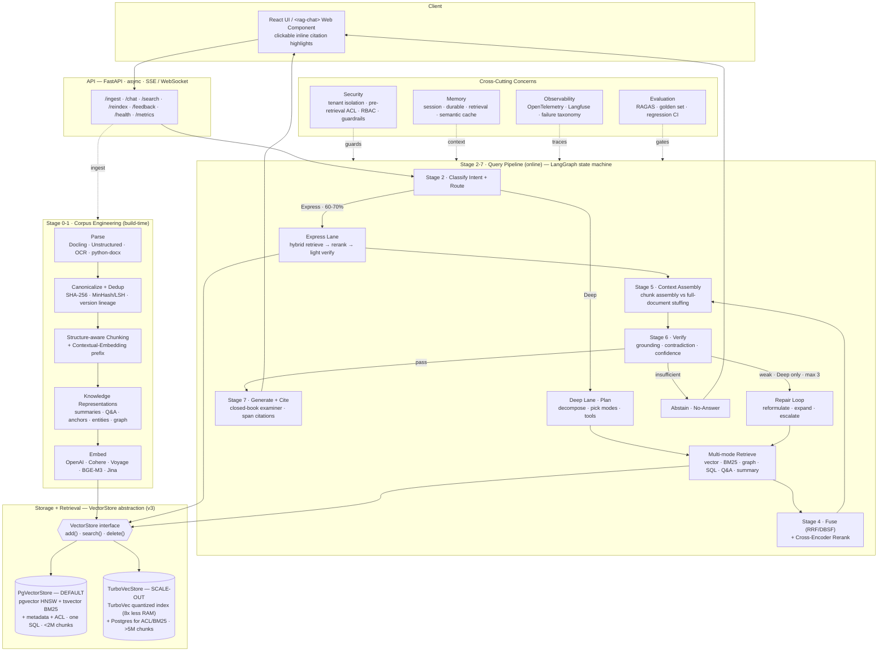
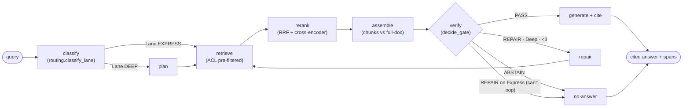
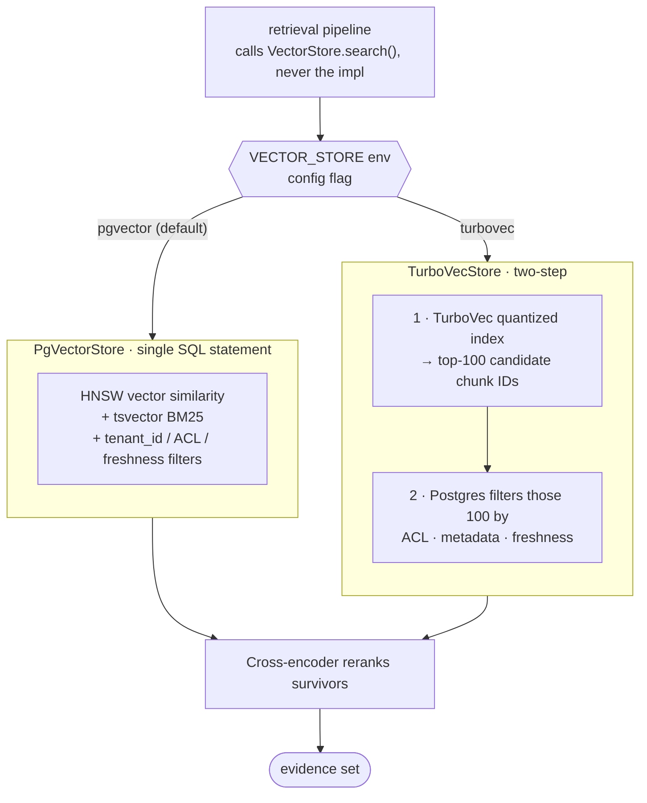
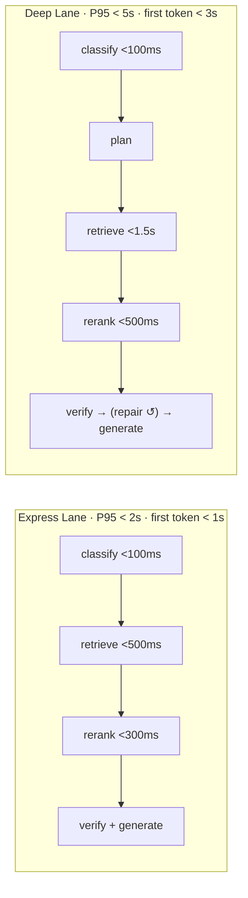

# Knowledge OS — Architecture (spec v3, June 2026)

Diagrams for the Enterprise Knowledge OS. Built against
[spec v3](../../knowledge-os-spec-2026-v3.md). v3 = v2 + a pluggable **VectorStore**
abstraction (PgVectorStore default / TurboVecStore scale-out). All diagrams are
Mermaid — they render on GitHub and in most Markdown viewers.

---

## 1. System architecture (layered)

The whole system in one view: offline corpus engineering feeds the stores; the
online query path forks into Express/Deep lanes; cross-cutting concerns wrap both.

---

## 2. Query lifecycle — the LangGraph spine

This is exactly what `app/graph.py` compiles. The classifier forks; both lanes
share retrieve → rerank → assemble → verify → generate; only the Deep Lane loops.

---

## 3. VectorStore abstraction — the v3 delta

Why the abstraction exists and how the two implementations differ. Note ACL stays
in Postgres in BOTH paths — TurboVec is only a candidate generator.

### When to use which (spec v3 decision table)

| Chunk count | pgvector RAM (d=1536) | TurboVec RAM (4-bit) | Recommendation |
|---|---|---|---|
| < 10K | < 150 MB | — | pgvector, **skip HNSW** (flat scan is faster) |
| 10K–500K | 150 MB–7 GB | — | pgvector + HNSW |
| 500K–2M | 7–30 GB | 375 MB–1.5 GB | pgvector preferred; monitor P95 |
| 2M–5M | 30–75 GB | 1.5–3.8 GB | gray zone; evaluate both |
| 5M+ | 75+ GB | 3.8+ GB | **TurboVecStore** |

**Switching triggers** (monitor in prod): HNSW build time > ingestion SLA · P95
vector query > 100ms · memory pressure evicts HNSW from shared buffers. When any
fire: run both for a week, compare P95 + recall, flip `VECTOR_STORE=turbovec`.

---

## 4. Performance budget (where latency is spent)

Blended P95 target < 3s, predicated on Express carrying 60-70% of traffic.
